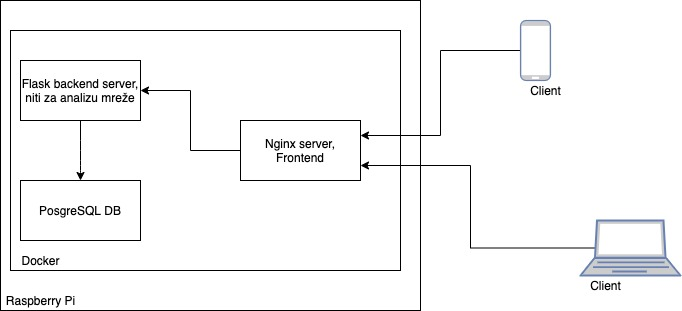

<b>Network activity diagnostic tool on raspberry pi</b>
 

## Stack:
 * Hardware platform: <b>Raspberry Pi</b>
 * Virtualisation: <b>Docker containers</b>
 * Backend api for network statistics: <b>Flask</b>
 * Network statistics library: <b>Nmap</b>
 * Database: <b>PostgreSQL</b>
 * Frontend: <b>React</b>
 * System entry point: <b>Nginx</b>

 

