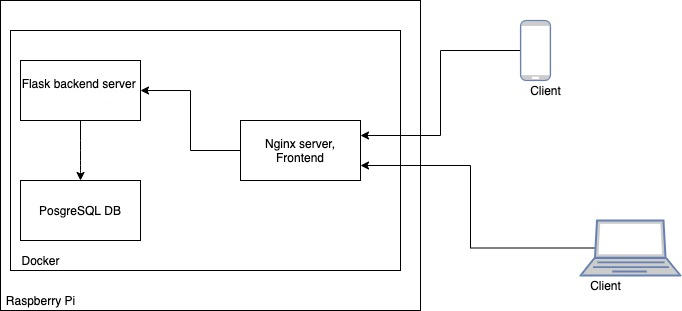

<b>Network activity diagnostic tool on raspberry pi</b>
<br/>


### Build:
#### For this step all [dependencies](#dependencies) need to be installed and docker-macine setup.

 * Build frontend:
``` bash
./build-front.sh [--install-packages] --raspberry-ip <Raspberry ip address>
# --install-packages needed only on first build.
# For more help run: ./build-front.sh --help
```

 * Connect to raspberry docker deamon with docker-machine:
``` bash
eval "$(docker-machine env <Machine name>)"
```

 * Compose and start docker containers on raspberry:
``` bash
./build.sh [--recreate-db]
# --recreate-db when set db will be recreated (needed on first run).
# For more help run: ./build.sh --help
```


### Stack:
 * Hardware platform: <b>Raspberry Pi</b>
 * Virtualization: <b>Docker containers</b>
 * Backend api for network statistics: <b>Flask</b>
 * Network statistics library: <b>Nmap</b>
 * Database: <b>PostgreSQL</b>
 * Frontend: <b>React</b>
 * System entry point: <b>Nginx</b>

<br/>



### Dependencies:
 * [NPM](https://www.npmjs.com/)
 * [Docker](https://www.docker.com/)
 * [Docker Compose](https://docs.docker.com/compose/install/)
 * [Docker Machine](https://docs.docker.com/machine/install-machine/)
 * [Raspberry Pi with docker setup](/How-to-101/raspberry_101.MD#docker-instalation).

