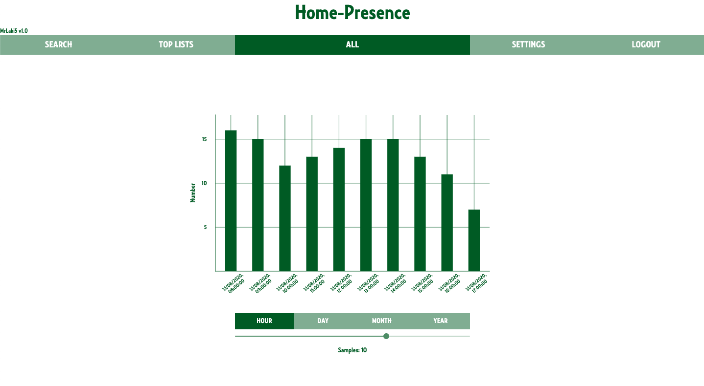
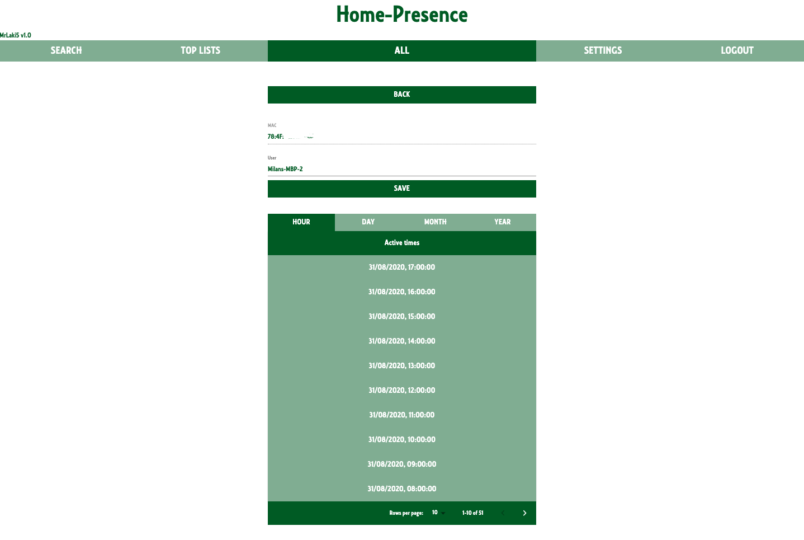
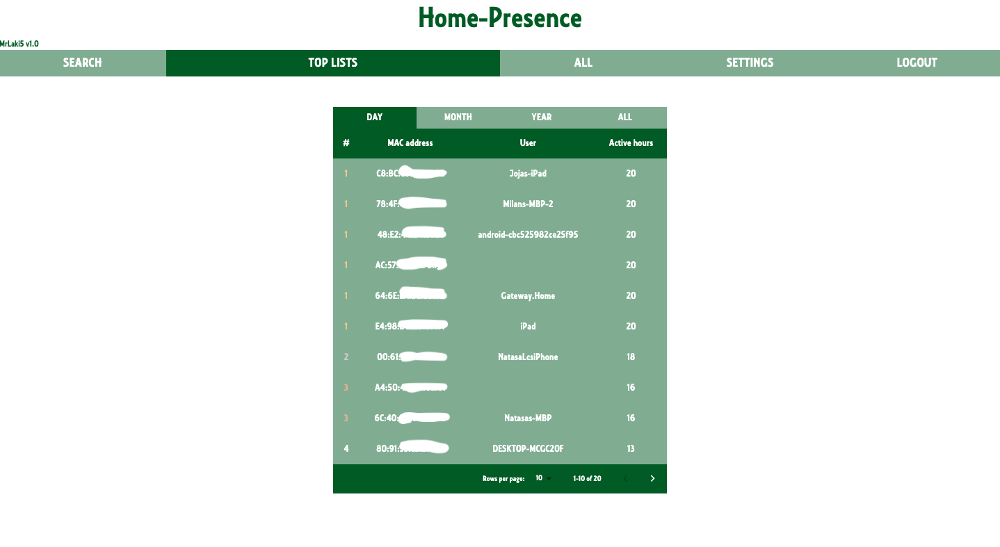
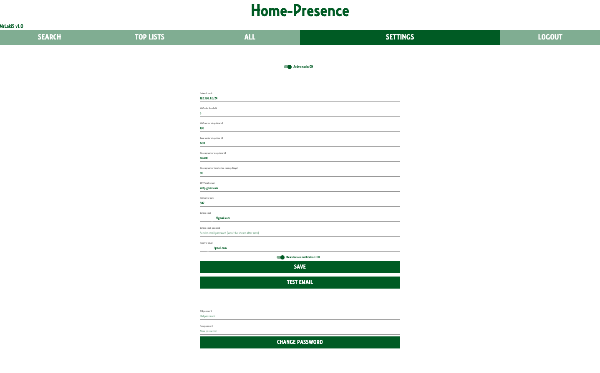

<b>Network devices activity diagnostic tool on raspberry pi</b>
<br/>

* <b>Track devices activity over time on your local network</b>
* <b>Be notified, with email, when new device is connected on your local network</b>
* <b>Have overview of active times of every device on your local network</b>
* <b>Have overview of top lists of devices with most active hours on your local network per: day, month, year, all time</b>
 
<hr/>

### Quick start:

* [Build and run Home-presence](#build)
* From browser go to Raspberry Pi's ip address
* Login, default password is: "toor"
* Under settings set network attribute to match with used network
* Under settings press start workers to start collecting data 

<hr/>

### Build:
#### Commands run on host os to build and compose project to Raspberry Pi. For this step all [dependencies](#dependencies) need to be installed and [docker-macine setup](#docker-machine-host-setup).

 * Build frontend:
``` bash
./build-front.sh [--install-packages] --raspberry-ip <Raspberry ip address>
# <raspberry ip address>: IP address of Raspberry Pi in local network.
# --install-packages needed only on first build.
# For more help run: ./build-front.sh --help
```

 * Connect to raspberry docker deamon with docker-machine:
``` bash
eval "$(docker-machine env <Machine name>)"
# <Machine name>: Name of docker-machine
```

 * Compose and start docker containers on raspberry:
``` bash
./build.sh [--recreate-db]
# --recreate-db when set db will be recreated (needed on first run).
# For more help run: ./build.sh --help
```

<hr/>

### Dependencies:
 * [Raspberry Pi with docker setup](https://github.com/MrLaki5/How-to-101/blob/master/raspberry_101.MD#docker-instalation) (Raspberry PI) 
 * [NPM](https://www.npmjs.com/) (Host)
 * [Docker](https://www.docker.com/) (Host)
 * [Docker Compose](https://docs.docker.com/compose/install/) (Host)
 * [Docker Machine](https://docs.docker.com/machine/install-machine/) (Host)

<hr/>

### Docker-machine host setup:
#### Commands run on host os to setup docker machine for communication with raspberry.

 * Generate SSH key for docker-machine communication:
``` bash
ssh-keygen
```

 * Add generated key to raspberry:
``` bash
ssh-copy-id -i <path to generated ssh key> pi@<raspberry ip address>
# <raspberry ip address>: IP address of Raspberry Pi in local network.
# <path to generated ssh key>: Path to key generated in previous steps.
```

 * Create docker-machine:
``` bash
docker-machine create --driver generic --generic-ip-address <Raspberry ip address> --generic-ssh-user pi --generic-ssh-key <path to generated ssh key> --engine-storage-driver overlay2 <Machine name>
# <raspberry ip address>: IP address of Raspberry Pi in local network.
# <path to generated ssh key>: Path to key generated in previous steps.
# <Machine name>: Name of docker-machine that will be used to connect to Raspberry.
```

<hr/>

### Interface overview:

Interface is composed of multiple pages that are used for collected data representation and system parameterization. Interface pages are shown on images below:
* #### Graphs of active device numbers per time


* #### List of active device in specific period of time


* #### Specific device information and active times


* #### Top lists of devices with most active times in last [Day, Month, Year, All time]


* #### Settings with system parameterization, options to set update times of network analysis, setup email for new devices notifications, change system password


<hr/>

### Stack:

 * Hardware platform: <b>Raspberry Pi</b>
 * Virtualization: <b>Docker containers</b>
 * Backend api for network statistics: <b>Flask</b>
 * Network statistics library: <b>Nmap</b>
 * Database: <b>PostgreSQL</b>
 * Frontend: <b>React</b>
 * System entry point: <b>Nginx</b>

<br/>


